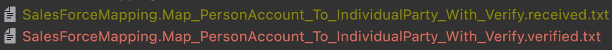

# Approval CSharp kata
## Objectives
* Discover how and why use an object-object mapper library
* Practice Approval testing approach and discover how powerful it can be with several Use Cases :
  * Check mappings
  * Check API results in Integration Tests
  * Check non deterministic data
  * Combination approvals

## Prerequisites
* .NET 6
* Your favorite IDE
* Access to nuget.org

## Libraries
* Object-object mapper : [`AutoMapper`](https://automapper.org/)
* Approval Testing : [`Verify`](https://github.com/VerifyTests/Verify)
* Test Framework : [`xUnit`](https://xunit.net/)
* Assertions : [`FluentAssertions`](https://fluentassertions.com/)

## Step-by-step kata
### 1) Object-object mapper
#### Fix the test `Should_Map_Employee_To_EmployeeEntity` by using `Auto-Mapper`
* Add AutoMapper package dependencies in `Approval.Web` and `Approval.Tests`
* Create a `MapperProfile` class in `Approval.Web`
  * Configure this mapping `Employee -> EmployeeEntity`

```c#
public class MapperProfile: Profile
{
    public MapperProfile()
    {
        CreateMap<Employee, EmployeeEntity>();
    }
}
```  

* Configure the test to use a mapper instance generated based on the production code configuration :

```c#
private readonly IMapper _mapper;

public EmployeeMapping()
{
    var config = new MapperConfiguration(cfg => { cfg.AddProfile<MapperProfile>(); });
    _mapper = config.CreateMapper();
}

[Fact]
public void Should_Map_Employee_To_EmployeeEntity()
{
    var employee = new Employee(9, "John", "Doe",
        "john.doe@gmail.com", new DateTime(2022, 2, 7),
        2, "IT department");

    var entity = _mapper.Map<EmployeeEntity>(employee);

    entity.Should().NotBeNull();
    entity.Id.Should().Be(employee.EmployeeId);
    entity.FirstName.Should().Be(employee.FirstName);
    entity.LastName.Should().Be(employee.LastName);
    entity.Email.Should().Be(employee.Email);
    entity.DateOfBirth.ToDateTime(TimeOnly.MinValue).Should().Be(employee.DateOfBirth.Date);
    entity.DepartmentId.Should().Be(employee.DepartmentId);
    entity.Department.Should().Be(employee.Department);
}
```

> It should throw an `ArgumentException` : Approval.Shared.Data.EmployeeEntity needs to have a constructor with 0 args or only optional args.
* As we use `record` types we need to specify our non 1-to-1 mapping through `.ForCtorParam` (more infos [here](https://docs.automapper.org/en/stable/Construction.html))
    * In this example we need to specify how we want to map `Id` and `DateOfBirth`

```c#
public MapperProfile()
{
    CreateMap<Employee, EmployeeEntity>()
        .ForCtorParam("Id", opt => opt.MapFrom(src => src.EmployeeId))
        .ForCtorParam("DateOfBirth", opt => opt.MapFrom(src => DateOnly.FromDateTime(src.DateOfBirth)));
}
```

* Our test is now green and we have a first functional mapping through `AutoMapper`
* What is surprising you ?
* How could it be helpful in your current projects ?

#### Add a new "feature" that brings mapping from `PersonAccount` to `IndividualParty`
* Let`s start by the test
```c#
private IndividualParty MapAlCaponeToIndividualParty() => null;

[Fact]
public void Map_PersonAccount_To_IndividualParty()
{
    var party = MapAlCaponeToIndividualParty();

    party.Gender.Should().Be(Gender.Male);
    party.Title.Should().Be("Mr.");
    party.BirthCity.Should().Be("Brooklyn");
    party.BirthDate.Should().Be(25.January(1899));
    party.FirstName.Should().Be("Al");
    party.LastName.Should().Be("Capone");
    party.MiddleName.Should().Be("");
    party.PepMep.Should().BeFalse();
    party.Documents.Should().HaveCount(1);

    var document = party.Documents.ElementAt(0);
    document.Number.Should().Be("89898*3234");
    document.DocumentType.Should().Be("ID CARD");
    document.ExpirationDate.Should().Be(5.January(2000));
}
```
* Refactor our test classes to have a common way to deal with `AutoMapper`
    * Create a `MappingTests` class 
    * Plug the 2 classes on it
```c#
public class MappingTests
{
    protected readonly IMapper Mapper;

    protected MappingTests()
    {
        var config = new MapperConfiguration(cfg => { cfg.AddProfile<MapperProfile>(); });
        Mapper = config.CreateMapper();
    }
}

public class SalesForceMapping : MappingTests
{
    private IndividualParty MapAlCaponeToIndividualParty() 
        => Mapper.Map<IndividualParty>(DataBuilder.AlCapone());

    [Fact]
    public void Map_PersonAccount_To_IndividualParty()
    {
        var party = MapAlCaponeToIndividualParty();

        party.Gender.Should().Be(Gender.Male);
        party.Title.Should().Be("Mr.");
        party.BirthCity.Should().Be("Brooklyn");
        party.BirthDate.Should().Be(25.January(1899));
        party.FirstName.Should().Be("Al");
        party.LastName.Should().Be("Capone");
        party.MiddleName.Should().Be("");
        party.PepMep.Should().BeFalse();
        party.Documents.Should().HaveCount(1);

        var document = party.Documents.ElementAt(0);
        document.Number.Should().Be("89898*3234");
        document.DocumentType.Should().Be("ID CARD");
        document.ExpirationDate.Should().Be(5.January(2000));
    }
}
```
* Congrats the test is now red : `Missing type map configuration or unsupported mapping`
* We need to register mapping between 2 records 
  * Before, let's refactor our code to make it more flexible (*robust to refactoring*) to add a new Map :
  * Create class `AutoMapperExtensions`
```c#
public static class AutoMapperExtensions
{
    public static IMappingExpression<TSource, TDestination> MapRecordMember<TSource, TDestination, TMember>(
        this IMappingExpression<TSource, TDestination> mappingExpression,
        Expression<Func<TDestination, TMember>> destinationMember, Expression<Func<TSource, TMember>> sourceMember)
    {
        var memberName = ReflectionHelper.FindProperty(destinationMember).Name;

        return mappingExpression
            .ForMember(destinationMember, opt => opt.MapFrom(sourceMember))
            .ForCtorParam(memberName, opt => opt.MapFrom(sourceMember));
    }
}
```
* Refactor existing mapping
```c#
CreateMap<Employee, EmployeeEntity>()
            .MapRecordMember(dest => dest.Id, src => src.EmployeeId)
            .MapRecordMember(dest => dest.DateOfBirth, src => DateOnly.FromDateTime(src.DateOfBirth)); 
```
* Register the new mapping
```c#
public MapperProfile()
{
    CreateMap<Employee, EmployeeEntity>()
        .MapRecordMember(dest => dest.Id, src => src.EmployeeId)
        .MapRecordMember(dest => dest.DateOfBirth, src => DateOnly.FromDateTime(src.DateOfBirth));

    CreateMap<PersonAccount, IndividualParty>()
        .MapRecordMember(dest => dest.Title, src => src.Salutation)
        .MapRecordMember(dest => dest.Gender,
            src => src.FinServ__Gender_pc == "M" ? Gender.Male : Gender.Female)
        .MapRecordMember(dest => dest.BirthCity, src => src.CityOfBirth__pc)
        .MapRecordMember(dest => dest.BirthDate, src => DateTime.Parse(src.PersonBirthdate).Date)
        .MapRecordMember(dest => dest.PepMep, src => bool.Parse(src.PEPMEPType_pc))
        .MapRecordMember(dest => dest.Documents, src => ToIdentityDocuments(src));
}

private static readonly Func<PersonAccount, IEnumerable<IdentityDocument>>
    ToIdentityDocuments = src =>
    {
        var documents = new List<IdentityDocument>
        {
            new IdentityDocument(
                Number: src.LegalDocumentNumber1__c,
                DocumentType: src.LegalDocumentName1__c,
                ExpirationDate: DateTime.Parse(src.LegalDocumentExpirationDate1__c)
            )
        };

        if (!string.IsNullOrEmpty(src.LegalDocumentNumber2__c))
        {
            documents.Add(
                new IdentityDocument(
                    Number: src.LegalDocumentNumber2__c,
                    DocumentType: src.LegalDocumentName2__c,
                    ExpirationDate: DateTime.Parse(src.LegalDocumentExpirationDate2__c)
                ));
        }

        return documents;
    };
```
 
* Discuss how easy it is to add new mappings

### 2) Approval Testing
Also called : Characterization Tests OR Snapshot Tests or Golden Master

> A picture’s worth a 1000 tests.

* Unit testing assertions can be difficult to use and long to write
* Approval tests simplify this by taking a snapshot of the results / confirming that they have not changed at each run

This technique can be used on :
* On any new code
* On legacy code

#### Check your mapping
* Add a new test to check this mapping `PersonAccount -> IndividualParty` by using the `Verify` library
* First, add `Verify.xUnit` package dependency in `Approval.Tests`
* Add a new Test
  * To use `Verify` with xUnit there are 2 thinks to make :
    * Our `Facts` need to return a `Task`
    * Our Test classes must be decorated with `UsesVerify`
```c#
[Fact]
public Task Map_PersonAccount_To_IndividualParty_With_Verify()
    => Verify(MapAlCaponeToIndividualParty());
```
* When you run the test, the library will create 2 files :

* It will use the `verified` file to make the assertions on our SUT
  * We need to exclude the `received` ones from our git repository
    * Simply add those line in your `.gitignore`

```text
## Verify
*.received.*
```
* We can make our initial verification to assert visually if the result is as expected
  * More details about this step [here](https://github.com/VerifyTests/Verify#initial-verification)
  * Let's check the result
```json
{
  Title: Mr.,
  LastName: Capone,
  FirstName: Al,
  MiddleName: ,
  BirthCity: Brooklyn,
  BirthDate: DateTime_1,
  Documents: [
    {
      Number: 89898*3234,
      DocumentType: ID CARD,
      ExpirationDate: DateTime_2
    }
  ]
}
```
* We have a problem here because our Dates have been replaced (Scrubbed in Approval language)
  * By default, `Verify` will scrub non deterministic data (`Guid`, `Dates`, ...)
  * Know more about [scrubbing](https://github.com/VerifyTests/Verify/blob/main/docs/scrubbers.md)
  * We can override this behavior like this

```c#
[Fact]
public Task Map_PersonAccount_To_IndividualParty_With_Verify()
    => Verify(MapAlCaponeToIndividualParty())
        .ModifySerialization(_ => _.DontScrubDateTimes());
```

* Now we receive this :

```json
{
  Title: Mr.,
  LastName: Capone,
  FirstName: Al,
  MiddleName: ,
  BirthCity: Brooklyn,
  BirthDate: 1899-01-25,
  Documents: [
    {
      Number: 89898*3234,
      DocumentType: ID CARD,
      ExpirationDate: 2000-01-05
    }
  ]
}
```

* We can now `approve` this result :
  * We can use `Verify Addin` in `Resharper` or `Rider`
    * Use it from the `Unit Tests` panel
  * `Drag & Drop` the received file on the Test Class to have this file depending on its Test Class


* What do you think about it ?

#### Integration Tests with Verify
* Create a `Controller` containing a GET method returning `IndividualParties`
  * Hardcoded once by using `DataBuilder` (Capone / Mesrine)
  * Check its behavior by using "classical" assertions
  * Check it with `Verify`
  * Compare the effort needed in both cases
  * Discuss the pros and cons of those 2 approaches

#### Non deterministic data
* Create a new `Controller` containing a GET method returning `Montana`
  * How do you handle non-deterministic data in your tests ?
  * Use `Verify` to check your API result

#### Refactor legacy code
We have an improvable piece of code in our code base :
```c#
public static Template FindTemplateFor(string documentType, string recordType)
{
    foreach (var dtt in TemplateMappings())
    {
        if (dtt.DocumentType.ToString().Equals(documentType, StringComparison.InvariantCultureIgnoreCase) &&
            dtt.RecordType.ToString().Equals(recordType, StringComparison.InvariantCultureIgnoreCase))
        {
            return dtt;
        }
        else if (dtt.DocumentType.ToString()
                     .Equals(documentType, StringComparison.InvariantCultureIgnoreCase) &&
                 dtt.RecordType.ToString().Equals("ALL"))
        {
            return dtt;
        }
    }

    throw new ArgumentException("Invalid Document template type or record type");
}
```

* Before refactoring it we need to add some tests
  * Add at least 2 Test Cases : Successful one and an Edge Case
* Let's use the power of ApprovalTesting to check all the possible combinations without effort
  
* 
    * Generate combinations and have only 1 `verified` file