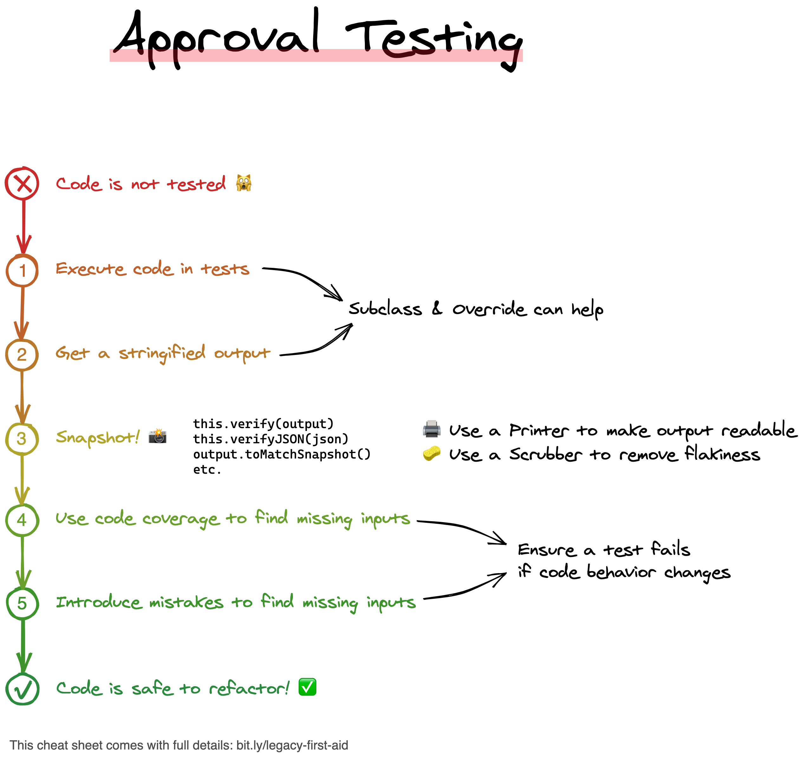

# Approval CSharp kata
## Objectives
* Discover how and why use an object-object mapper library
* Practice Approval testing approach and discover how powerful it can be with several Use Cases :
  * Check mappings
  * Check API results in Integration Tests
  * Check non deterministic data
  * Combination approvals

## Prerequisites
* .NET 6
* Your favorite IDE
* Access to nuget.org

## Libraries
* Object-object mapper : [`AutoMapper`](https://automapper.org/)
* Approval Testing : [`Verify`](https://github.com/VerifyTests/Verify)
* Test Framework : [`xUnit`](https://xunit.net/)
* Assertions : [`FluentAssertions`](https://fluentassertions.com/)

## Step-by-step kata
### 1) Object-object mapper
#### Fix the test `Should_Map_Employee_To_EmployeeEntity` by using `Auto-Mapper`
* Add AutoMapper package dependencies in `Approval.Web` and `Approval.Tests`
* Create a `MapperProfile` class in `Approval.Web`
  * Configure this mapping `Employee -> EmployeeEntity`

```c#
public class MapperProfile: Profile
{
    public MapperProfile()
    {
        CreateMap<Employee, EmployeeEntity>();
    }
}
```  

* Configure the test to use a mapper instance generated based on the production code configuration :

```c#
private readonly IMapper _mapper;

public EmployeeMapping()
{
    var config = new MapperConfiguration(cfg => { cfg.AddProfile<MapperProfile>(); });
    _mapper = config.CreateMapper();
}

[Fact]
public void Should_Map_Employee_To_EmployeeEntity()
{
    var employee = new Employee(9, "John", "Doe",
        "john.doe@gmail.com", new DateTime(2022, 2, 7),
        2, "IT department");

    var entity = _mapper.Map<EmployeeEntity>(employee);

    entity.Should().NotBeNull();
    entity.Id.Should().Be(employee.EmployeeId);
    entity.FirstName.Should().Be(employee.FirstName);
    entity.LastName.Should().Be(employee.LastName);
    entity.Email.Should().Be(employee.Email);
    entity.DateOfBirth.ToDateTime(TimeOnly.MinValue).Should().Be(employee.DateOfBirth.Date);
    entity.DepartmentId.Should().Be(employee.DepartmentId);
    entity.Department.Should().Be(employee.Department);
}
```

> It should throw an `ArgumentException` : Approval.Shared.Data.EmployeeEntity needs to have a constructor with 0 args or only optional args.
* As we use `record` types we need to specify our non 1-to-1 mapping through `.ForCtorParam` (more infos [here](https://docs.automapper.org/en/stable/Construction.html))
    * In this example we need to specify how we want to map `Id` and `DateOfBirth`

```c#
public MapperProfile()
{
    CreateMap<Employee, EmployeeEntity>()
        .ForCtorParam("Id", opt => opt.MapFrom(src => src.EmployeeId))
        .ForCtorParam("DateOfBirth", opt => opt.MapFrom(src => DateOnly.FromDateTime(src.DateOfBirth)));
}
```

* Our test is now green and we have a first functional mapping through `AutoMapper`
* What is surprising you ?
* How could it be helpful in your current projects ?

#### Add a new "feature" that brings mapping from `PersonAccount` to `IndividualParty`
  * Discuss how easy it is to add new mappings

### 2) Approval Testing
Also called : Characterization Tests OR Snapshot Tests or Golden Master

> A picture’s worth a 1000 tests.

* Unit testing assertions can be difficult to use and long to write
* Approval tests simplify this by taking a snapshot of the results / confirming that they have not changed at each run

This technique can be used on :
* On any new code
* On legacy code

#### Check your mapping
* Add a new test to check this mapping `PersonAccount -> IndividualParty` by using the `Verify` library
  * What do you think about it ?

#### Integration Tests with Verify
* Create a `Controller` containing a GET method returning `IndividualParties`
  * Hardcoded once by using `DataBuilder` (Capone / Mesrine)
  * Check its behavior by using "classical" assertions
  * Check it with `Verify`
  * Compare the effort needed in both cases
  * Discuss the pros and cons of those 2 approaches

#### Non deterministic data
* Create a new `Controller` containing a GET method returning `Montana`
  * How do you handle non-deterministic data in your tests ?
  * Use `Verify` to check your API result

#### Refactor legacy code
We have an improvable piece of code in our code base :
```c#
public static Template FindTemplateFor(string documentType, string recordType)
{
    foreach (var dtt in TemplateMappings())
    {
        if (dtt.DocumentType.ToString().Equals(documentType, StringComparison.InvariantCultureIgnoreCase) &&
            dtt.RecordType.ToString().Equals(recordType, StringComparison.InvariantCultureIgnoreCase))
        {
            return dtt;
        }
        else if (dtt.DocumentType.ToString()
                     .Equals(documentType, StringComparison.InvariantCultureIgnoreCase) &&
                 dtt.RecordType.ToString().Equals("ALL"))
        {
            return dtt;
        }
    }

    throw new ArgumentException("Invalid Document template type or record type");
}
```

* Before refactoring it we need to add some tests
  * Add at least 2 Test Cases : Successful one and an Edge Case
* Let's use the power of ApprovalTesting to check all the possible combinations without effort
  
* 
    * Generate combinations and have only 1 `verified` file